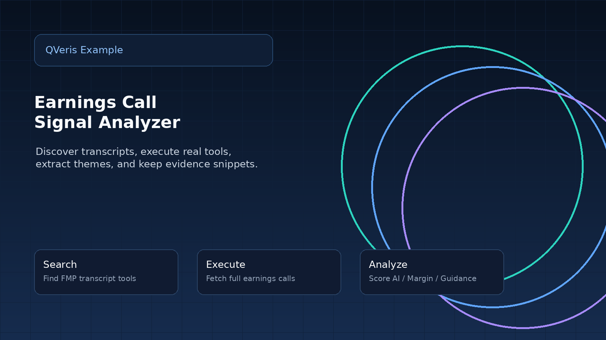
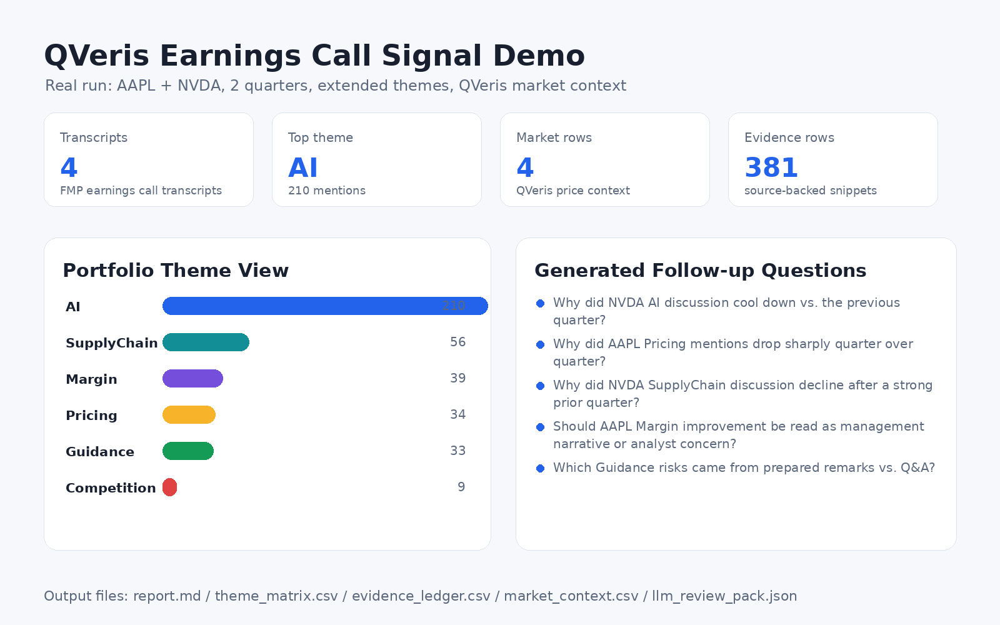
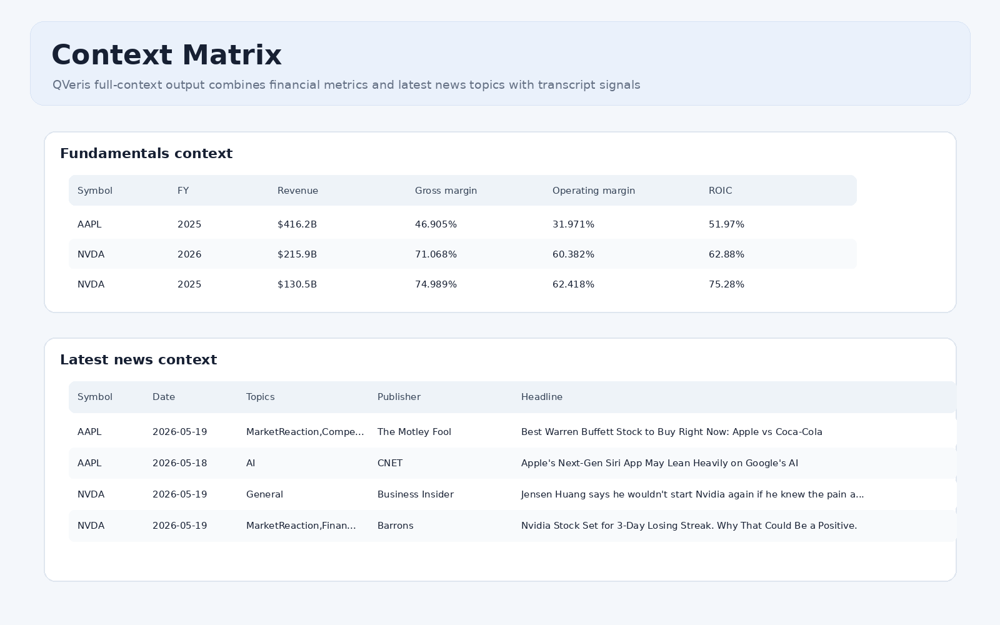
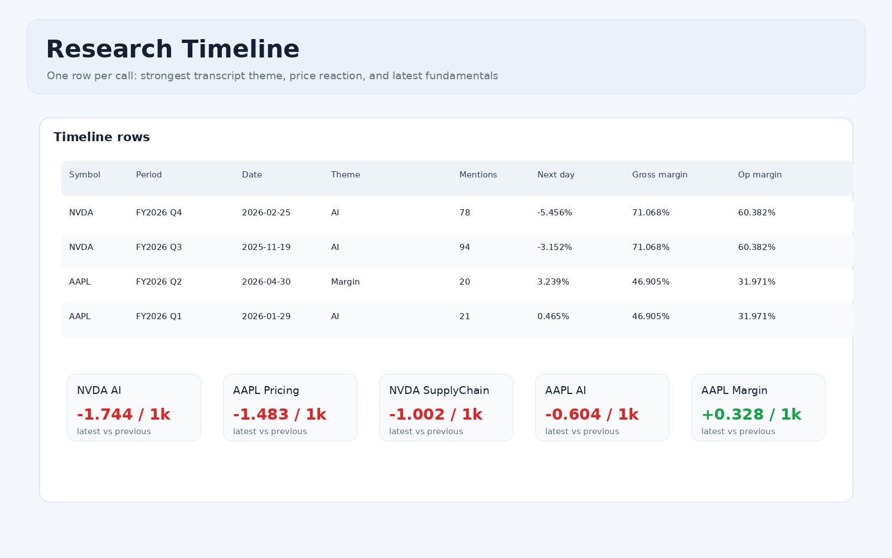
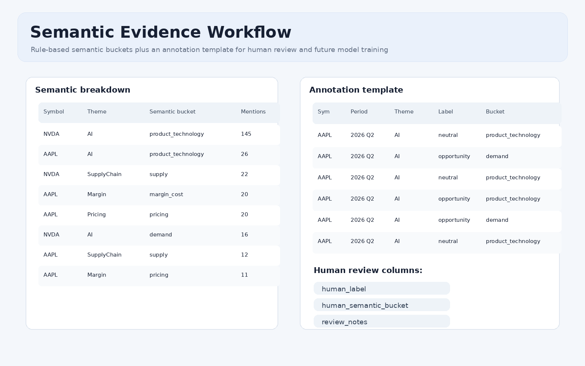
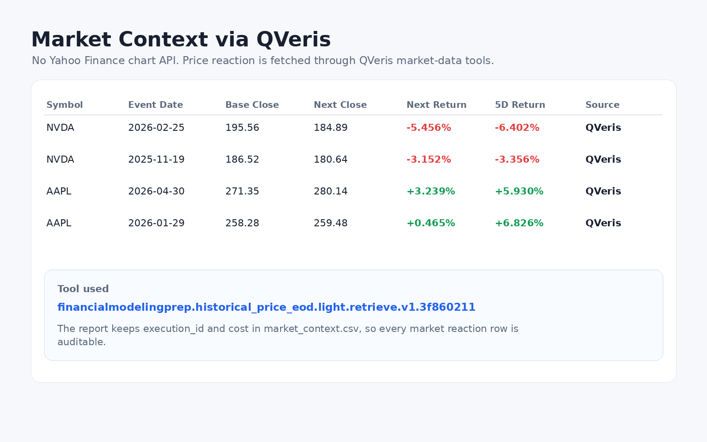
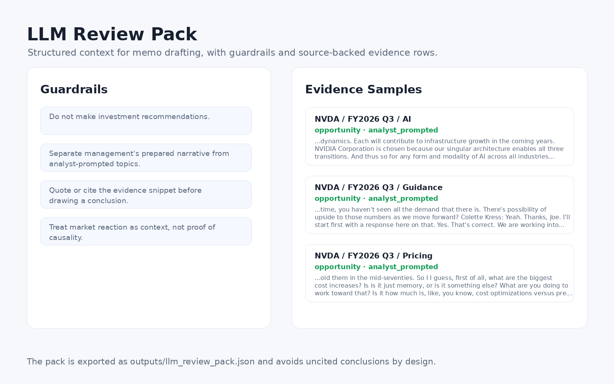

# 用 QVeris 把财报电话会逐字稿变成可追溯的投研线索

这是一篇第三方实践记录。示例程序已经继续扩展到 full-context 版本：除了财报电话会逐字稿，也把电话会后的市场表现、基础财务指标、新闻上下文、语义分类、人工标注模板和 LLM 复核包放进同一条工作流。

> 核心目标没有变：不是自动给投资建议，而是把多家公司、多季度电话会里的主题变化整理成可复核的研究线索，并保留每一条信号背后的原文证据和数据调用记录。



## 一、从一个真实问题开始

财报电话会逐字稿很适合做投研 Agent 的基础数据源。它比新闻更接近公司一线表达，比财报表格更容易反映管理层对业务、风险和未来预期的叙述方式。

但逐字稿也有明显问题：单份 transcript 往往有几万字，多家公司、多季度一起看时，人工阅读成本很高。如果只是让模型“总结一下”，又容易丢掉证据来源，最后很难复核。

| 传统做法 | 主要瓶颈 | 这次尝试 |
|---|---|---|
| 先找接口、写脚本、拉数据，再人工整理重点。 | 工具发现、参数填充、跨公司对比、证据回溯都需要重复劳动。 | 用 QVeris 完成工具发现和执行，把分析逻辑集中在投研问题本身。 |

## 二、示例程序现在做了什么

程序名称是 `QVeris Earnings Call Signal Demo`。它的输入很简单：股票代码、最近几个季度、关注主题。新版运行方式使用 `--full-context`，会一次性拉取逐字稿、市场上下文、基础面数据和新闻上下文。



| 输出 | 用途 |
|---|---|
| Markdown / JSON 报告 | 快速阅读结论，同时保留完整结构化结果。 |
| `theme_matrix.csv` | 比较不同公司和季度的主题频率。 |
| `theme_timeseries.csv` | 按公司、季度、主题展开长期序列，适合继续做趋势图。 |
| `evidence_ledger.csv` | 保留每个主题命中的原文片段、说话人、来源语境和语义桶。 |
| `market_context.csv` | 记录电话会后的下一交易日和 5 个交易日市场表现。 |
| `fundamentals_context.csv` | 记录收入、毛利率、经营利润率、ROIC、Capex / Revenue 等基础面指标。 |
| `news_context.csv` | 把最新新闻标题按 AI、Product、Financials、Competition、Regulation 等主题归类。 |
| `research_timeline.csv` | 把电话会主题、市场反应和最新基础面指标放到一张表里。 |
| `semantic_breakdown.csv` | 把证据拆成 demand、supply、pricing、margin_cost、competition 等语义桶。 |
| `annotation_template.csv` | 抽样证据行，预留人工标注列，后续可形成评估样本。 |
| `llm_review_pack.json` | 给 LLM 或人工复核使用，包含 guardrails、上下文和证据样本。 |

## 三、一次真实运行

我用 AAPL 和 NVDA 各取最近两个季度，跑出了 4 份逐字稿。新版完整运行约 12 秒，生成了 381 条证据片段和 12 个输出文件。

| 公司 | 期间 | 日期 | 最强主题 | 电话会后下一交易日 |
|---|---|---|---|---:|
| AAPL | FY2026 Q2 | 2026-04-30 | Margin | 3.239% |
| AAPL | FY2026 Q1 | 2026-01-29 | AI | 0.465% |
| NVDA | FY2026 Q4 | 2026-02-25 | AI | -5.456% |
| NVDA | FY2026 Q3 | 2025-11-19 | AI | -3.152% |

主题结果里，AI 是最强信号，共 210 次提及，由 NVDA 领先；SupplyChain、Margin、Pricing、Guidance 也形成了可比较的主题矩阵。这里的数字不是结论，而是下一步阅读原文的索引。

## 四、把电话会放进更完整的上下文

只看逐字稿容易忽略外部背景。新版程序通过 QVeris 继续调用基础面和新闻类工具，把最近财年的收入、毛利率、经营利润率、ROIC，以及最新新闻主题放到同一份结果里。



这样做的价值在于：当某个主题升温或降温时，分析师可以同时看到基础面指标和外部新闻叙事。例如 Margin / Pricing 主题可以和毛利率、经营利润率一起看，AI / Product 主题可以和近期新闻标题一起看。

## 五、研究时间线：把主题、市场和基础面并起来

`research_timeline.csv` 是这次新增的关键产物。它按电话会逐行整理最强主题、提及次数、电话会后的市场表现，以及最新基础面指标，适合做第一轮筛选。



同时，`theme_timeseries.csv` 会按公司、季度、主题输出 `mentions_per_1k_words`、机会/风险语境、管理层主动叙述/分析师追问等字段。后续如果继续扩展，可以直接把它做成长期趋势图。

## 六、证据台账、语义分类和人工标注

投研分析里最怕的是“看起来像结论，但不知道从哪里来的结论”。这个 demo 会生成 `evidence_ledger.csv`，每一行都包含公司、季度、命中主题、关键词、说话人、prepared remarks / Q&A 分段、管理层主动叙述 / 分析师追问 / 管理层回答等来源分类，以及原文片段。

新版还增加了轻量语义桶，例如 demand、supply、pricing、margin_cost、competition、regulation_macro、product_technology。这不是最终模型，只是一个可解释的起点：先让证据变得可分组，再通过人工标注逐步改进。



> 真正有价值的不是把逐字稿总结成几段话，而是把数据发现、调用、对比、证据留存和人工复核这一整条链路跑通。

## 七、电话会议内容是如何获取的

> 市场上下文用的是历史价格工具，但它只是后续补充背景。这个 demo 的第一性数据来源是 earnings call transcript，电话会期次和逐字稿正文同样都是通过 QVeris 搜索并执行工具获取的。

程序没有直接硬编码外部接口地址，而是先让 QVeris 搜索“电话会日期”和“电话会正文”两类工具。搜索命中后，再用返回的 `search_id` 关联后续执行。

| 数据 | QVeris 工具 | 参数 | 作用 |
|---|---|---|---|
| 电话会日期列表 | `financialmodelingprep.stable.earningcalltranscriptdates.retrieve.v1.34503129` | `symbol` | 查询某家公司有哪些可用的财报电话会期次。 |
| 电话会逐字稿正文 | `financialmodelingprep.stable.earningcalltranscript.retrieve.v1.5db0c651` | `symbol`, `year`, `quarter` | 拉取指定公司、年份、季度的 earnings call transcript 内容。 |

实际流程是：先搜索工具，再对每个股票代码调用 transcript dates 工具，例如输入 `AAPL`，返回可用的 fiscal year、quarter 和日期；随后按用户传入的 `--quarters` 选取最近几个期次；最后对每个期次调用 transcript content 工具，传入 `symbol/year/quarter` 拉取正文。

```text
QVeris /search
  -> transcript dates tool
  -> periods: symbol + fiscalYear + quarter + date
  -> transcript content tool
  -> content
  -> speaker / Q&A / theme / evidence analysis
```

拿到 `content` 字段后，程序才进入后续分析：说话人识别、prepared remarks / Q&A 分段、主题命中、风险/机会语境、语义桶和证据台账。市场价格、基础面和新闻都是在逐字稿分析完成之后补进来的上下文。

这也是为什么文章里强调“可追溯”：报告不只展示主题统计，还会记录 QVeris 搜索命中的 tool、执行结果、`execution_id`、cost，以及每条主题信号对应的原文片段。

### 如何参考微信公众号文章

这个 demo 不是照着公众号文章复述一遍，而是把文章里的产品思路转成一个可以运行的第三方实践。

| 参考方式 | 落地到 demo |
|---|---|
| 提取核心主张 | QVeris 的价值不只是“有很多 API”，而是可以通过自然语言搜索工具、理解工具用途、再执行真实调用。 |
| 选择具体场景 | 财报电话会逐字稿天然适合展示“搜索工具 -> 调用数据 -> 结构化分析 -> 留存证据”的完整链路。 |
| 做成可运行产物 | 不是停留在概念说明，而是做成命令行程序、网页 dashboard、HTML 报告、CSV 证据台账和在线 Live Run。 |
| 用真实调用验证 | 运行结果里能看到 tool_id、execution_id、cost、返回数据和证据片段，说明程序确实走了 QVeris search + execute。 |

换句话说，公众号文章提供的是“为什么 QVeris 适合做 API Agent 基础设施”的方向；这个 demo 做的是“拿一个真实投研问题，把这条路径跑通”。

## 八、通过 QVeris 获取市场上下文

程序不直接调用外部 chart 接口，而是通过 QVeris 搜索并调用市场数据工具获取历史 EOD 价格。当前使用的工具是：

```text
financialmodelingprep.historical_price_eod.light.retrieve.v1.3f860211
```



这一步的意义不是用股价反应证明电话会内容，而是给分析师一个背景：哪些电话会后的市场反应值得和主题变化放在一起看。程序会把 `execution_id`、`cost`、`market_tool_id` 一起写入 CSV，方便追溯。

## 九、LLM 复核包

为了避免 LLM 生成没有出处的结论，程序额外导出 `llm_review_pack.json`。这个文件包含 guardrails、主题视图、市场上下文、基础面上下文、新闻摘要、证据样本和一个面向复核 memo 的 prompt。



它的定位不是让模型直接给投资建议，而是让模型基于证据生成复核问题，帮助人更快进入“该回看哪段原文”的状态。

## 十、实现上的一个小改进：外部调用要能降级

这次完整运行时，逐字稿接口曾出现过一次 `ReadTimeout`。程序因此补了一个实用改动：日期和逐字稿调用如果单次失败，不再让整个分析崩掉，而是把失败记录进 `missing_transcripts` 和执行元数据里，其他公司、其他季度仍然可以继续产出结果。

这类 demo 如果要变成可长期运行的工具，外部接口超时、空结果、部分失败都应该是正常分支，而不是异常终点。

## 十一、运行方式

```bash
uv sync
cp .env.example .env
uv run earnings-signal \
  --symbols AAPL,NVDA,TSM \
  --quarters 2 \
  --theme-set extended \
  --themes AI,Margin,Guidance,SupplyChain,Pricing,Competition \
  --full-context
```

代码地址：

https://github.com/ax2/qveris-earnings-call-signal-demo

## 十二、这个程序是如何实现的

> 实现重点不是把某个接口写死，而是把 QVeris 的工具搜索和工具执行能力接到一个真实投研工作流里：先发现可用工具，再调用真实数据，最后把逐字稿转成可追溯的主题信号。

这个 demo 的实现思路并不复杂：先把“找数据接口”和“调用数据接口”交给 QVeris，再把精力放到投研工作流本身。程序内部没有硬编码某个固定接口，而是先用自然语言搜索可用工具，再根据搜索结果选择最合适的 tool 执行。

| 步骤 | 说明 |
|---|---|
| 搜索工具 | 用 QVeris `/search` 搜索财报电话会日期、逐字稿、历史价格、基础财务指标和新闻类工具。 |
| 执行工具 | 拿到 `search_id` 和 `tool_id` 后，通过 `/tools/execute` 拉取真实数据。 |
| 结构化清洗 | 把逐字稿拆成说话人、管理层/分析师、prepared remarks / Q&A 等结构。 |
| 主题识别 | 按 AI、Margin、Guidance、Supply Chain、Pricing、Competition 等主题统计提及次数、每千词频率和风险/机会语境。 |
| 证据留存 | 把所有命中片段写入 `evidence_ledger.csv`，同时生成 Markdown、JSON、CSV 和网页报告。 |

### 几个关键概念

| 概念 | 作用 |
|---|---|
| Tool discovery | 不预设具体 API，而是让 QVeris 根据自然语言需求返回候选工具。 |
| Search ID | 搜索结果和后续执行之间的关联 ID，执行工具时需要带上。 |
| Evidence ledger | 每一条分析信号都保留原文片段、说话人、主题和上下文，避免只有结论没有出处。 |
| Context enrichment | 电话会内容之外，再补充市场表现、基础面指标和新闻背景。 |
| Live Run | 网页上实时触发 QVeris search + execute，验证程序不是静态报告。 |

### 实际给 Codex 的指令

整个开发过程基本都由 Codex 完成。指令不是“一次性写完程序”，而是按阶段不断收敛：先确定方向，再扩展能力，然后部署、测试、修复和更新文章。

```text
阅读QVeris官微的文章https://mp.weixin.qq.com/s/LYAgdIidj1ElOldx6wfL2Q，参照这个文章实现一个有意义的程序，需要有实际效果。代码单独放一个仓库，在demo目录下建一个子目录，然后推送到github。
```

这一步确定了项目方向：做一个能把财报电话会逐字稿转成结构化投研线索的 demo。Codex 先搭出 Python 项目、QVeris 客户端、分析器和命令行入口。

```text
按文章最终的可以继续扩展的方向扩展 qveris-earnings-call-signal-demo。
不要使用 Yahoo Finance chart 接口，使用QVeris的工具获取数据。
```

这一步把程序从“只分析 transcript”扩展成完整上下文版本。因为明确要求不要使用 Yahoo Finance chart 接口（第一版 AI 会根据自己的理解尝试直接使用这个接口，但是会失败，所以这里明确建议使用 QVeris 的工具），市场数据改成通过 QVeris 搜索并调用市场数据工具获取。

```text
按新的程序进行截图，并更新文档。
继续按“下一步还可以继续做什么”里面说的完善这个程序，按需截图并更新文章。另外，代码增加 LICENSE，使用 MIT 授权。
```

这一步补齐了截图、报告、LICENSE 和文章内容。Codex 不是只写代码，也负责运行程序、生成输出文件、截取页面、更新文档。我们在写文章的同时同步完成 demo 程序，整个过程是逐步迭代的，文章每次的最后会有一个章节说明“下一步还可以继续做什么”，我们可以让 Codex 根据这些内容继续推进，根据需要可以适当调整。

```text
在测试机器上部署这个程序。
除了 Markdown Report 的内容，还可以增加一个 Report 按钮，直接显示 HTML 格式的页面。更新代码、文档并同步部署到 testlab。
```

这一步把 demo 从命令行程序变成可访问的网页应用。Codex 增加了 FastAPI 服务、首页 dashboard、HTML 报告页、截图页和 systemd 用户服务。事先需要告诉 Codex 测试机器的访问方式，可以让它自己去设置免密登录。第一版的程序只有 Markdown Report，不是很直观，我们让 Codex 又生成了可以直接打开的 HTML 版本报告页面。

> 这个过程里比较有价值的经验是：AI 辅助开发适合拆成连续的小闭环。每一轮都让 Codex 做一件具体的事：实现、运行、截图、部署、测试、看日志、修正错误、更新文章。这样最后得到的不是一段孤立代码，而是一个有代码仓库、有在线地址、有运行记录、有文档说明、也能继续迭代的完整样例。

## 十三、后续还可以继续做什么

- 把 `theme_timeseries.csv` 接到图表页面，形成按公司和主题筛选的长期趋势视图。
- 把规则语义桶替换成可评估的小模型分类，但仍保留 evidence ledger 作为可追溯基础。
- 基于 `annotation_template.csv` 做人工标注，统计规则分类与人工分类的差异。
- 把新闻事件、基本面变化和电话会主题变化做成更明确的事件时间线。
- 增加更多数据源，但每个新增数据源都记录调用工具、参数、execution_id 和 cost。

---

本文只是一次可复现的小实验，不构成任何投资建议。对外使用时，还需要结合数据源条款、公司公告和人工判断。
